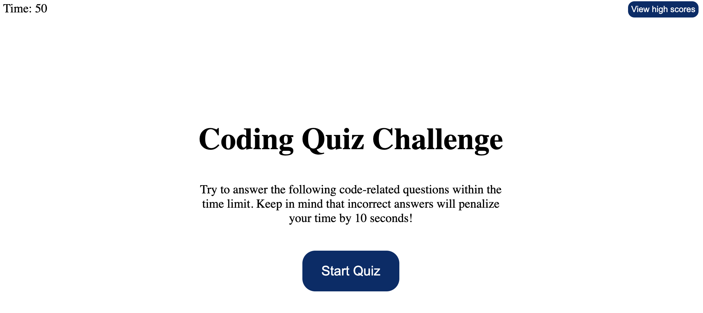

# quiz-app

## Description

This quiz app was designed for user who wants to test their skill in JavaScript. Users have 50 seconds to finish five multiple choice questions related to JavaScript. The faster you answer each question, the higher you can score. Keep in mind that incorrect answers will penalize your time by 10 seconds! Have Fun!

## Installation

N/A

## Usage

You can start the quiz by pressing the "Start Quiz" button. Once the button is clicked, you have 50 seconds to finish 5 multiple choice questions. During the quiz, if you choose the wrong answer, the penalty will apply. After you finished the quiz, your initial and score will be stored at the high score chart as a record. Share it with your friend and see whose better at JavaScript concept!

Quiz-app link: https://weithefang.github.io/quiz-app/

## Credits

N/A

## License

Please refer to the LICENSE in the repo
